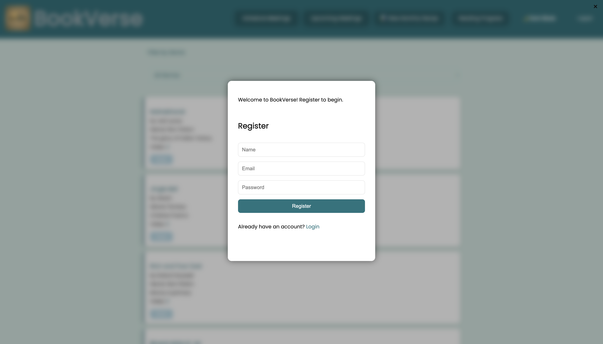

# BookVerse - Book Club Platform

## Introduction
**BookVerse** is a modern, interactive web application designed for book lovers to connect, share insights, and grow together through reading. This frontend-focused platform allows users to suggest books, participate in discussion forums, track their reading progress, schedule and attend book club meetings, and more. With a clean UI, dynamic features, and Firebase integration, BookVerse creates a seamless virtual book club experience.

## Project Type
Frontend

## Deployed App
Frontend: [https://bookverse-beta.vercel.app/]
Backend: _N/A (Frontend-only project)_ 
Database: [https://console.firebase.google.com]

## Directory Structure
bookverse/
    ├─ index.html
    ├─ reading.html
    ├─ README.md
    ├─ /assets/
  │  ├─ logo.ico   
  │  ├─ logo.png
    ├─ /firebase/
  │  ├─config.js
    ├─ /scripts/
  │  ├─ auth.js
  │  ├─ authModal.js
  │  ├─ dashboard.js
  │  ├─ fireworks.js
  │  ├─ suggestions.js
  │  ├─ discussions.js
  │  ├─ reading.js
  │  ├─ meetings.js
  │  ├─ theme.js
  │  ├─ upcoming-meetings.js
    ├─ /style/
  │  ├─ main.css  

## Video Walkthrough of the project

## Video Walkthrough of the codebase

## Features
- 🔐 User Authentication using Firebase (Register, Login, Logout)
- 📚 Book Suggestion System
- 💬 Interactive Discussion Forum with rich text, search, and pagination
- 📈 Reading Progress Tracker
- 📅 Meeting Scheduler with Upcoming Meetings Modal
- 🌙 Full Dark Mode support
- 📱 Fully responsive for mobile, tablet, and desktop

## Design Decisions or Assumptions
- Separate modals were used for login and registration for clarity and ease of management.
- Dark mode is applied globally and toggled via a button.
- Used Firebase Firestore for realtime sync of data like discussions and meetings.
- Reading progress and meeting scheduling are tied to user authentication for personalized experience.

## Installation & Getting started
# Clone the repository
git clone https://github.com/akash-collab/bookverse.git
cd bookverse

# No build tools like npm or webpack are required.

- To run the project:
- Option 1: Open index.html directly in a browser (may limit Firebase auth due to file:// protocol restrictions)
- Option 2: Use Live Server (recommended)

- If using VS Code:
- 1. Install the Live Server extension.
- 2. Right-click on index.html and select "Open with Live Server".

# Firebase Setup (Required):
- 1. Go to https://console.firebase.google.com
- 2. Create a new Firebase project
- 3. Enable Email/Password Authentication
- 4. Enable Firestore Database (in test mode during development)
- 5. Replace config values in /firebase/config.js with your Firebase project credentials

## Firebase Authentication
- Firebase Firestore Database

## Usage
# Once the project is running locally or deployed:
-	1.	Register/Login
-		On first visit, users are shown a registration modal.
-		After successful registration, they’re redirected to the login modal.
-		Authentication is handled via Firebase.
-	2.	Book Suggestions
-		Users can view suggested books on the homepage.
-	3.	Discussion Forum
-		Users can participate in threaded discussions for each book.
-		Rich text comments are supported via Quill.js.
-		Includes search and pagination.
-	4.	Reading Progress Tracker
-		Click on Reading Progress to log your books and track reading       completion as a percentage.
-	5.	Schedule & View Meetings
-		Users can schedule book discussions by providing title, date/time, and link.
-		Upcoming meetings can be viewed in a modal with options to join or dismiss.
-	6.	Dark Mode Support
-		Toggle between light and dark themes. The UI adapts across all pages.

## Screenshots
- 
- 
- 
- 
- 
- 
- 
- 

## Credentials
- Email - akashakii774@gmail.com
- Password - akashio90

## Technology Stack
- HTML, CSS, JavaScript
- Firebase (Auth, Firestore)
- Quill.js for rich text editor
- Google Fonts (Poppins)
- Responsive Web Design